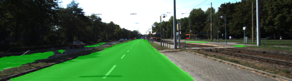

# Semantic Segmentation
## Introduction:
The goal of this project was to implement a fully convolutional neural network based on the VGG-16 image classifier architecture for performing semantic segmentation to identify drivable road area from an car dashcam image (trained and tested on the KITTI data set).

## Code description:
The relevant code is inside [`main.py`](./main.py). The code downloads a pre-trained VGG16 model and extracts the input, keep probability, layer 3, layer 4 and layer 7 from it in method [`load_vgg`](./main.py#L22). Those layers are used in the [`layers`](./main.py#L50) to create the rest of the network:

- One convolutional layer with kernel 1 from VGG's layer 7 ([line 61](./main.py#L61)).
- One deconvolutional layer with kernel 4 and stride 2 from the first convolutional layer ([line 67](./main.py#L67)).
- One convolutional layer with kernel 1 from VGG's layer 4 ([line 73](./main.py#L73)).
- The two layers above are added to create the first skip layer ([line 78](./main.py#L78)).
- One deconvolutional layer with kernel 4 and stride 2 from the first ship layer ([line 81](./main.py#L81)).
- One convolutional layer with kernel 1 from VGG's layer 3 ([line 87](./main.py#L87)).
- The two layers above are added to create the second skip layer ([line 93](./main.py#L93)).
- One deconvolutional layer with kernel 16 and stride 8 from the second skip layer ([line 96](./main.py#L96)).

All convolutional and deconvolutional layer use random-normal kernel initializer and kernel regularizer:
- kernel_initializer: **random_normal_initializer(stddev=0.01)**
- kernel_regularizer: **l2_regularizer(1e-3)**

## Training:
- image_shape: 160, 576 
- epochs: 50
- batch_size: 15
- keep_prob: 0.5 (Dropout)
- Optimizier: Adam
- learning_rate: 0.001
- Augmentation: flip

```python
# performe a vertical flip for every second image 
if flip_lr and np.random.choice(2, 1)[0] == 1:
    image = np.fliplr(image)
    gt_image = np.fliplr(gt_image)
```

## Results:
The following table shows the batch loss of the training process: 
- Epoch 1  / 50 - Total Loss: 22.3538  Time 2018-02-08 14:24:20
- Epoch 2  / 50 - Total Loss: 6.6362  Time 2018-02-08 14:24:49
- Epoch 3  / 50 - Total Loss: 4.2783  Time 2018-02-08 14:25:18
- Epoch 4  / 50 - Total Loss: 3.8539  Time 2018-02-08 14:25:47
- Epoch 5  / 50 - Total Loss: 3.4950  Time 2018-02-08 14:26:16
- Epoch 6  / 50 - Total Loss: 3.2787  Time 2018-02-08 14:26:45
- Epoch 7  / 50 - Total Loss: 3.1222  Time 2018-02-08 14:27:13
- Epoch 8  / 50 - Total Loss: 2.9936  Time 2018-02-08 14:27:42
- Epoch 9  / 50 - Total Loss: 2.8839  Time 2018-02-08 14:28:11
- Epoch 10  / 50 - Total Loss: 2.8537  Time 2018-02-08 14:28:40
- Epoch 11  / 50 - Total Loss: 2.8068  Time 2018-02-08 14:29:09
- Epoch 12  / 50 - Total Loss: 2.5500  Time 2018-02-08 14:29:38
- Epoch 13  / 50 - Total Loss: 2.5969  Time 2018-02-08 14:30:07
- Epoch 14  / 50 - Total Loss: 2.4435  Time 2018-02-08 14:30:36
- Epoch 15  / 50 - Total Loss: 2.2413  Time 2018-02-08 14:31:04
- Epoch 16  / 50 - Total Loss: 2.0882  Time 2018-02-08 14:31:33
- Epoch 17  / 50 - Total Loss: 1.9489  Time 2018-02-08 14:32:02
- Epoch 18  / 50 - Total Loss: 2.0781  Time 2018-02-08 14:32:30
- Epoch 19  / 50 - Total Loss: 1.9425  Time 2018-02-08 14:32:59
- Epoch 20  / 50 - Total Loss: 1.7228  Time 2018-02-08 14:33:28
- Epoch 21  / 50 - Total Loss: 1.7758  Time 2018-02-08 14:33:57
- Epoch 22  / 50 - Total Loss: 1.6556  Time 2018-02-08 14:34:26
- Epoch 23  / 50 - Total Loss: 1.6079  Time 2018-02-08 14:34:55
- Epoch 24  / 50 - Total Loss: 1.5519  Time 2018-02-08 14:35:24
- Epoch 25  / 50 - Total Loss: 1.4477  Time 2018-02-08 14:35:53
- Epoch 26  / 50 - Total Loss: 1.4724  Time 2018-02-08 14:36:21
- Epoch 27  / 50 - Total Loss: 1.3943  Time 2018-02-08 14:36:50
- Epoch 28  / 50 - Total Loss: 1.3295  Time 2018-02-08 14:37:19
- Epoch 29  / 50 - Total Loss: 1.4690  Time 2018-02-08 14:37:48
- Epoch 30  / 50 - Total Loss: 1.3922  Time 2018-02-08 14:38:17
- Epoch 31  / 50 - Total Loss: 1.2677  Time 2018-02-08 14:38:45
- Epoch 32  / 50 - Total Loss: 1.3177  Time 2018-02-08 14:39:14
- Epoch 33  / 50 - Total Loss: 1.2229  Time 2018-02-08 14:39:43
- Epoch 34  / 50 - Total Loss: 1.4280  Time 2018-02-08 14:40:12
- Epoch 35  / 50 - Total Loss: 1.9168  Time 2018-02-08 14:40:41
- Epoch 36  / 50 - Total Loss: 1.5780  Time 2018-02-08 14:41:10
- Epoch 37  / 50 - Total Loss: 1.4171  Time 2018-02-08 14:41:39
- Epoch 38  / 50 - Total Loss: 1.4428  Time 2018-02-08 14:42:08
- Epoch 39  / 50 - Total Loss: 1.2386  Time 2018-02-08 14:42:36
- Epoch 40  / 50 - Total Loss: 1.1752  Time 2018-02-08 14:43:05
- Epoch 41  / 50 - Total Loss: 1.1296  Time 2018-02-08 14:43:34
- Epoch 42  / 50 - Total Loss: 1.0562  Time 2018-02-08 14:44:03
- Epoch 43  / 50 - Total Loss: 1.0495  Time 2018-02-08 14:44:31
- Epoch 44  / 50 - Total Loss: 1.0230  Time 2018-02-08 14:45:00
- Epoch 45  / 50 - Total Loss: 1.0542  Time 2018-02-08 14:45:29
- Epoch 46  / 50 - Total Loss: 0.9918  Time 2018-02-08 14:45:57
- Epoch 47  / 50 - Total Loss: 0.9428  Time 2018-02-08 14:46:26
- Epoch 48  / 50 - Total Loss: 0.9386  Time 2018-02-08 14:46:55
- Epoch 49  / 50 - Total Loss: 0.9245  Time 2018-02-08 14:47:24
- Epoch 50  / 50 - Total Loss: 0.9746  Time 2018-02-08 14:47:53

Training Finished. Saving test images to: ./runs\1518097673.3045516

The inference images are saved in the runs folder.

## Examples:





